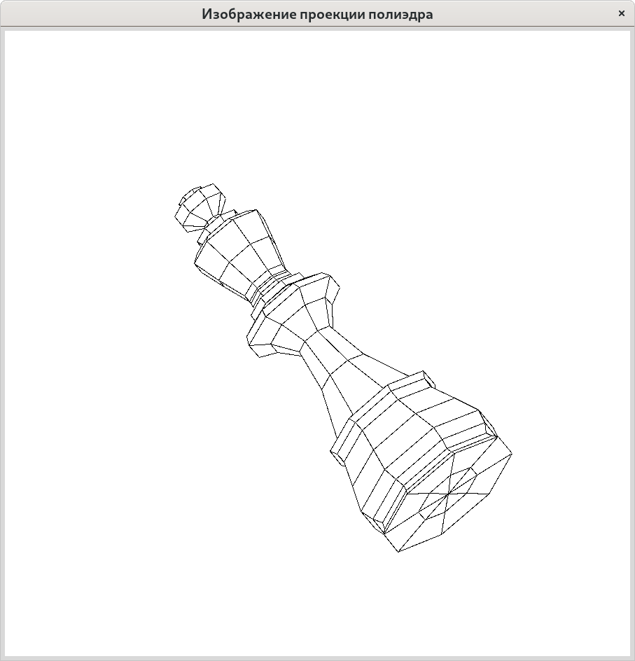

# Изображение проекции полиэдра

Построение изображения полиэдра с удалением невидимых линий — пример
классической задачи, для успешного решения которой необходимо знакомство
с основами вычислительной геометрии.

